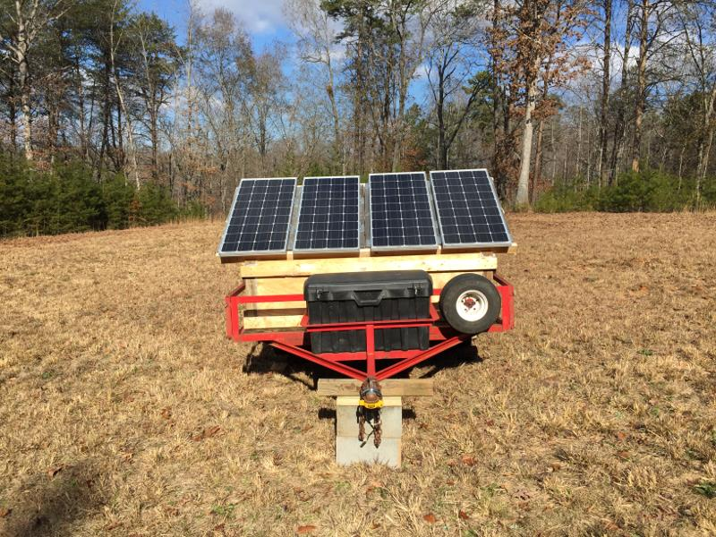
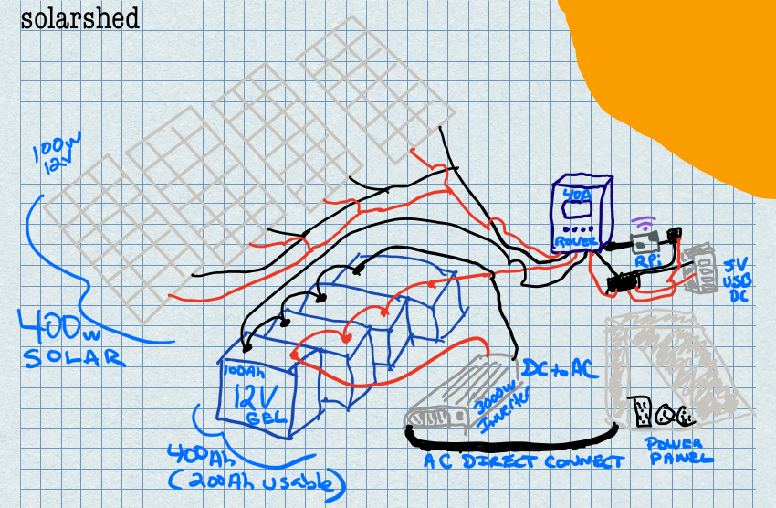

solarshed
=========

A Python library to help monitor solar charge controllers typically used in
off the grid applications.

The primary goal of the library is to provide a common interface in Python
for a variety of solar charge controllers.  A secondary goal is for easy monitoring
of off the grid solar installations via Prometheus using the included
solarshed.server module.  This project has been in use for several months on a
Raspberry Pi connected to a Renogy Rover solar controller.  This off the grid
solar installation is mobile on a trailer and links up to WiFi for monitoring
and alerting via Prometheus (with solar production visualized using Grafana)

solarshed wiring sketch
-----------------------

The solarshed trailer pictured above is a working prototype of what can be done
with relatively inexpensive parts and things that might already be laying around
(like old wood pallets).  Here's a rough sketch of what's inside the box under
the 4 100w 12v panels (wired in parallel for 400w total):

In addition to the panels, there are 4 100Ah 12v gel batteries also wired in parallel
for 400Ah storage capacity. 200Ah is usable before battery back hits 50% capacity and
protections kick in to protect battery life.  A DC to AC power inverter is directly
wired to the battery bank (with a slow blow fuse inline on the positive connection).
A set of 4 USB charging ports is also available to avoid the need of the power inverter
when charging 5v USB items (small batteries, phones, tablets, portable speakers, etc)
The USB ports are connected to the load terminals on the solar charge controller along
with the power for the Raspberry Pi (connected with a DC to DC buck converter to step
down 12v to 5v).  This allows you to monitor the energy used by the Pi and whatever is
charging over USB when you begin to collect the data from the solar charge controller.
For convenience, the DC to AC power inverter makes use of a direct connect terminal for
wiring it up to an external temporary power panel that's mounted on the outside of the trailer.
This external power panel makes it easy to quickly connect the solarshed to typical
120v AC loads as well as quick connection to 30amp and 50amp cables typically used
for campers and RVs.  Note that this battery bank/inverter combination isn't sufficent
to provide high power to these campers.  It's more of a convenience to be able to
connect the solarshed to these units for powering things within them (lights, radios, tv, etc.)

A `parts list`_ is also available on Amazon.
Please consider using `Amazon Smile`_ and donating to `hub-ology`_ if you order parts there.

Folks have used the solarshed Python library with configurations both large and small.
This prototype solarshed trailer is just to provide a reference implementation that
can manage useful energy production off-grid for both AC and DC loads.

Supported Solar Charge Controllers
----------------------------------

* **Renogy Rover**
  The Renogy Rover is currently the only supported charge controller.
  New charge controllers should be added to the solarshed.controllers
  package.

Charge Controller module contributions are welcome if you have access
to the hardware to help test and verify functionality.

Installation
------------

::

    pip install solarshed

The latest solarshed release can be installed using pip.
Once installed, you'll be able to interactively work with the solarshed library
to build up your own custom tools.

::

    from solarshed.controllers.renogy_rover import RenogyRover

    controller = RenogyRover('/dev/ttyUSB0', 1)
    controller.charging_status()
    controller.load_power()
    controller.solar_power()
    controller.solar_voltage()
    controller.solar_current()
    controller.battery_voltage()

Methods are available to access all of the primary information made available by the 
solar charge controller.  Solar current, voltage and power are available to track
what your panels are doing at that moment.  The charging status/state helps you 
see when the controller is active (and in which mode) or deactivated (night time).
The load power usage can also be monitored to keep tabs on power consumption from the 
Pi monitoring the controller and any other loads attached.

You can also use the provided solarshed.server to export metrics from the solar 
charge controller to prometheus.

Prometheus Support
------------------

The solarshed library includes a server process that may be used in cases
where you'd like continuous monitoring of a solar installation.
This process periodically reads information from the connected solar controller
and exposes it as prometheus gauges for easy collection and monitoring.

::

    python -m solarshed.server

This will launch a python process that listens on port 5000 to serve up 
the Prometheus metrics.   It makes use of the `Prometheus Python client`_
You can run a check on your server process by running:

::

    curl http://localhost:5000/metrics

to verify you see metrics values that align with what you see on the solar charger controller
display.

Refer to the `Prometheus`_  website for official getting started and installation guides
for your system.

Grafana
-------

Most folks that make use of solarshed for the prometheus integration will also
want to use `Grafana`_ to build up dashboards to visualize the metrics they care
about the most.   A starter dashboard is included in the grafana folder in this
project.  You should be able to import it into your grafana installation and then
use it or modify it as desired.  Check out the `Grafana`_ website for more installation
information.

_`Amazon Smile`: https://smile.amazon.com/ch/46-3997463
_`hub-ology`: https://hub-ology.org
_`parts list`: https://smile.amazon.com/hz/wishlist/ls/3B032AJ0FD01N?&sort=default
_`Prometheus Python client`: https://github.com/prometheus/client_python
_`Prometheus`: https://prometheus.io/
_`Grafana`: https://grafana.com/
